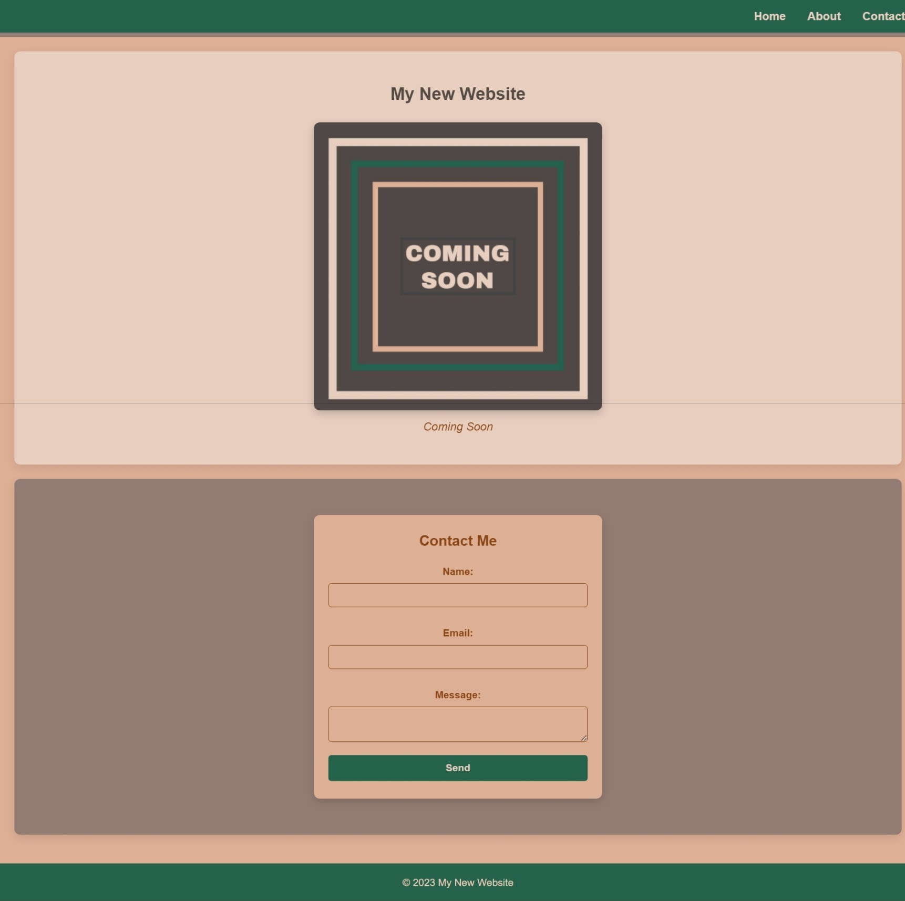

# Coming Soon Custom CSS


Welcome to **Coming Soon Custom CSS**! This repository contains a custom "Coming Soon" webpage styled with CSS animations and effects to create an engaging placeholder website.

## Screenshot



## Demo

> [!IMPORTANT]
> Check out the live demo on GitHub Pages: [https://lesley-byte.github.io/ComingSoonCustomCss](https://lesley-byte.github.io/ComingSoonCustomCss)

## Table of Contents

- [Overview](#overview)
- [Features](#features)
- [Getting Started](#getting-started)
- [Usage](#usage)
- [License](#license)

## Overview

This project serves as a "Coming Soon" page for a new website. It features a modern layout with CSS animations and a contact form for visitors to reach out before the official launch.

## Features

- **Smooth Animations**: Engaging CSS animations for page elements.
- **Responsive Layout**: Optimized for desktop and mobile viewing.
- **Contact Form**: A simple contact form with placeholders for back-end integration.

## Getting Started

### Prerequisites

You need a web browser to view this page. If you’d like to run the project locally and make changes, you’ll need:

- [Git](https://git-scm.com/) to clone the repository
- Basic knowledge of HTML/CSS to customize as needed

### Installation

1. **Clone the repository**:

   ```bash
   git clone git@github.com:lesley-byte/ComingSoonCustomCss.git
   cd ComingSoonCustomCss
   ```

2. **Open the `index.html` file** in your web browser.

## Usage

Feel free to customize the HTML and CSS files to match your branding and style. You can modify the text, colors, and animations as needed.

## License

This project is licensed under the MIT License. See the [LICENSE](LICENSE) file for more information.
